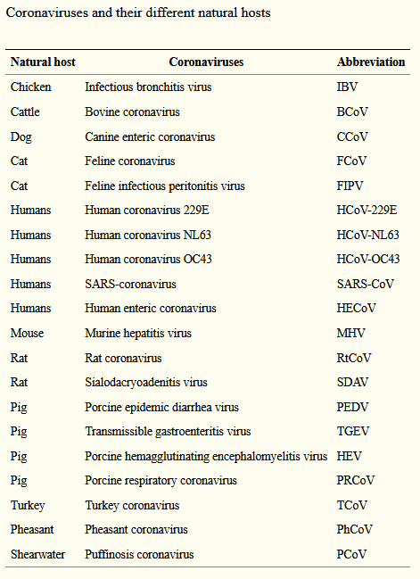
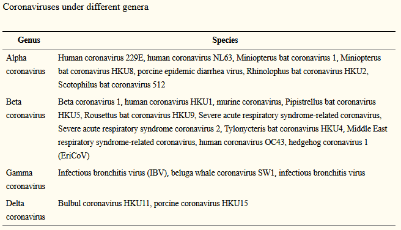

```{r setup, include=FALSE}
knitr::opts_chunk$set(echo = TRUE)
```

# ¿Cuáles son los virus “similares” a SARS-CoV-2 en el mundo? Obtén tus referencias de PUBMED.
```{r, echo=FALSE, out.width="100%", fig.cap="Tabla 1."}

```
Tabla 1. Diferentes tipo de virus, similares a Sars-Cov 2 y sus huéspedes.

Existen muchos tipos de coronavirus, que comparten la misma subfamilia (Coronaviridae) de ejemplo compararemos el tipo porcino (PEDV), con el tipo humano (SARS-CoV-2), para clasificar los diferentes tipos de coronavirus, está establecido que de la subfamilia hay una subdivisión en “genus” de los cuales hay “alpha, beta, gamma y delta”, y así mismo, los coronavirus beta, tienen sus divisiones en linajes siendo “a, b, c, d”. 

En el caso de alfa y beta, se tratan de virus que afectan a animales de sangre caliente, y en el caso de gamma y delta, afectan a pájaros y a unos pocos mamíferos. De los virus alfa y beta, existe una diferencia importante sobre el modo de ataque hacia humanos y a animales, en el caso de los humanos, ocasionan enfermedades respiratorias, mientras que en animales, causan enfermedades gastrointestinales.

Analizando el virus PEDV y el SARS-CoV-2, por una parte tenemos que el virus porcino pertenece a la clasificación alfa y el humano a la clasificación beta. Es importante saber los distintos tipos de virus aunque no sean humanos, ya que el monitoreo constante en otras especies animales, nos ayuda a identificar posibles riesgos de mutaciones entre distintas especies y se puede volver bastante útil conocer al virus antes de que ocasione una nueva epidemia en humanos. [1]

La característica similar de la familia, es la composición viral, dado que comporten cadenas de secuencia de RNA muy largas, sobre cualquier otro virus de RNA, incluso son similares en estructura, teniendo forma de corona, la cual son los tubos de información de los virus, que necesitan para poder transmitir su código genético en diferentes especies. 

La mayor diferencia entre Sars Cov 2 y su más similar Sars Cov, es la capa protectora de Sars Cov 2, la corona protectora resulta ser más resistente al ambiente, se le puede denominar como capa de grasa, para poder romper esta capa es necesario aplicar un jabón o gel antibacterial para removerla. Incluso dentro de su estructura hay diferencias entre la proteína S de una y otra.


# ¿Cuáles son los coronavirus reportados en otras especies que pueden ser cercanos al genoma de SARS-CoV-2? Incluye de qué especies son y menciona las referencias de los artículos consultados en PUBMED.
```{r, echo=FALSE, out.width="100%", fig.cap="Tabla 2."}

```
Tabla 2. Distintos géneros del coronavirus.

Dentro del género beta, que es en el que se encuentra el SARS-CoV-2 , existen relaciones con otras muchas especies de animales, entre ellos se encuentran los de murciélagos y puercoespines.


# En relación con la situación actual reflexiona, ¿qué propondrías que se deba hacer durante la contingencia del SARS-CoV-2 en comunidades de bajos recursos? Si tu vivieras en una situación de escasos recursos, ¿qué harías? Justifica tu respuesta.

Una de las cosas que se tendrían que hacer es garantizar el agua o gel antibacterial en estas comunidades, dado que la capa de Sars Cov 2, se puede romper con jabón o gel antibacterial, el promover el lavado de manos frecuente es la primera acción que se tiene que tomar en cuenta.


# Analizar las secuencias de SARS-CoV-2 reportadas en los 20 países con más casos reportados. Y puedes tratar de responder a la pregunta:
 
# ¿Son muy diferentes las variantes entre cada país? 

En general las variantes son muy similares, pero se diferencian en distintas mutaciones que afectan la transmisibilidad del virus, la letalidad y demás, pero principalmente esos dos aspectos son los de interés, así mismo, las variaciones son muy pequeñas.


# ¿Es diferente el SARS-CoV-2 entre las diferentes poblaciones: Asiática, Americana, Europea o Africana?

En cada población es diferente el virus, pero gracias al árbol filogenético, pudimos encontrar similitudes entre los diferentes continentes, y como cada uno es más cercano al otro.

La diferencia es mínima entre las diferentes regiones del mundo. A continuación pondremos las relaciones más cercanas dentro cada continente:

-----Asia: de Rusia, India, Indonesia y Turquía se observó que en la mayoría de los casos las similitudes son cercanas gracias a que se parecen mucho entre los países del mismo continente, aunque es cierto que dos que se relacionan (como el caso de Indonesia y Turquía) están alejados en el árbol filogenético de Rusia e India. 

-----América: de USA, México, Perú, Brasil y Argentina, están más estrechos al continente europeo, principalmente por la parte de las afueras de Europa.

-----Europa: en Francia, Países bajos, República Checa, Alemania, Italia, España, Inglaterra y Polonia tienen una relación global, porque dos secuencias pueden estar muy relacionadas con sólo una o varias de América, y puede llegar a repetirse en Asia.
 
-----África: Esta secuencia de nucleótido solo está relacionada con Alemania.


# Agrega una interpretación escrita de tus gráficas y tus conclusiones según el caso de estudio que seleccionaste. No olvides sustentar tus argumentos con las lecturas que realizaste.

En conclusión, el SARS-CoV-2 llegó a todo el mundo y con eso, las semejanzas y diferencias que encontramos en sus variantes. Pudimos apreciar, cómo es que cada cadena de Coronavirus de un país, se presentaba o se asemejaba a otro, por lo cual nos dice que aunque por muchos meses nos hayamos cuidado de no viajar o se hayan tomado las precauciones necesarias, no fueron suficientes para evitar esas mutaciones. Al igual, que no hay una regla de la que guiarse para pensar que una variante se quede en el mismo rango poblacional, ya que como observamos en nuestro árbol filogenético, no existe una relación directa entre variantes y continentes, ya que en ésta época, estamos tan globalizados, que las variantes se dispersan muy rápido.


# Referencias

[1] (2020). https://www.infezmed.it/media/journal/Vol_28_2_2020_7.pdf
[2] Classical coronaviruses. (2020, April 30). PubMed Central (PMC). https://www.ncbi.nlm.nih.gov/pmc/articles/PMC7189396/


```{r}
library(Biostrings)
library(seqinr)
library(adegenet)
library(ape)
library(ggtree)
library(DECIPHER)
library(viridis)
library(ggplot2)
```

```{r}
df <- read.csv("virus_proyecto.csv", header = TRUE)
```

```{r}
viruses <- read.GenBank(df[,1], as.character = TRUE)
```

```{r}
usa <- as.data.frame(count(viruses$MW981372, wordsize = 1))
india <- as.data.frame(count(viruses$MW927136, wordsize = 1))
brasil <- as.data.frame(count(viruses$MW592707, wordsize = 1))
francia <- as.data.frame(count(viruses$LR881474, wordsize = 1))
rusia <- as.data.frame(count(viruses$MW741552, wordsize = 1))
turquia <- as.data.frame(count(viruses$MW308549, wordsize = 1))
uk <- as.data.frame(count(viruses$OA982882, wordsize = 1))
italia <- as.data.frame(count(viruses$MW786740, wordsize = 1))
españa <- as.data.frame(count(viruses$MW976780, wordsize = 1))
alemania <- as.data.frame(count(viruses$MW822592, wordsize = 1))
argentina <- as.data.frame(count(viruses$MW633891, wordsize = 1))
colombia <- as.data.frame(count(viruses$MT470219, wordsize = 1))
polonia <- as.data.frame(count(viruses$HG994158, wordsize = 1))
iran <- as.data.frame(count(viruses$MW898809, wordsize = 1))
mexico <- as.data.frame(count(viruses$MW884219, wordsize = 1))
peru <- as.data.frame(count(viruses$MW938089, wordsize = 1))
indonesia <- as.data.frame(count(viruses$MZ026853, wordsize = 1))
checa <- as.data.frame(count(viruses$MT534285, wordsize = 1))
sudafrica <- as.data.frame(count(viruses$MW981442, wordsize = 1))
holanda <- as.data.frame(count(viruses$MW577029, wordsize = 1))
```

```{r}
Cantidades <- c(usa[1, 2], usa[2, 2], usa[3, 2], usa[4, 2], india[1, 2], india[2, 2], india[3, 2], india[4, 2], brasil[1, 2], brasil[2, 2], brasil[3, 2], brasil[4, 2], francia[1, 2], francia[2, 2], francia[3, 2], francia[4, 2], rusia[1, 2], rusia[2, 2], rusia[3, 2], rusia[4, 2], turquia[1, 2], turquia[2, 2], turquia[3, 2], turquia[4, 2], uk[1, 2], uk[2, 2], uk[3, 2], uk[4, 2], italia[1, 2], italia[2, 2], italia[3, 2], italia[4, 2], españa[1, 2], españa[2, 2], españa[3, 2], españa[4, 2], alemania[1, 2], alemania[2, 2], alemania[3, 2], alemania[4, 2], argentina[1, 2], argentina[2, 2], argentina[3, 2], argentina[4, 2], colombia[1, 2], colombia[2, 2], colombia[3, 2], colombia[4, 2], polonia[1, 2], polonia[2, 2], polonia[3, 2], polonia[4, 2], iran[1, 2], iran[2, 2], iran[3, 2], iran[4, 2], mexico[1, 2], mexico[2, 2], mexico[3, 2], mexico[4, 2], peru[1, 2], peru[2, 2], peru[3, 2], peru[4, 2], indonesia[1, 2], indonesia[2, 2], indonesia[3, 2], indonesia[4, 2], checa[1, 2], checa[2, 2], checa[3, 2], checa[4, 2], sudafrica[1, 2], sudafrica[2, 2], sudafrica[3, 2], sudafrica[4, 2], holanda[1, 2], holanda[2, 2], holanda[3, 2], holanda[4, 2])

Bases <- rep((c("a", "c", "g", "t")), c(1, 1, 1, 1))

#Paises <- rep((c("USA", "India", "Brasil", "Francia", "Rusia", "Turquía", "UK", "Italia", "España", "Alemania", "Argentina", "Colombia", "Polonia", "Irán", "México", "Perú", "Indonesia", "Rep. Checa", "Sudáfrica", "Holanda")), c(4, 4, 4, 4, 4, 4, 4, 4, 4, 4, 4, 4, 4, 4, 4, 4, 4, 4, 4, 4))

Paises <- rep((c("USA", "IN", "BR", "FR", "RU", "TR", "UK", "IT", "ES", "DE", "AR", "CO", "PL", "IR", "MX", "PE", "ID", "CZ", "ZA", "NL")), c(4, 4, 4, 4, 4, 4, 4, 4, 4, 4, 4, 4, 4, 4, 4, 4, 4, 4, 4, 4))

dfgrafica <- data.frame (Paises, Bases, Cantidades)
```

# Gráfica de longitudes de variantes
```{r}
ggplot(data=dfgrafica, aes(x=Paises, y=Cantidades, fill=Bases)) + 
    geom_bar(stat="identity", position="dodge")
```

```{r}
virus_secuencias <- read.GenBank(df[,1])
```

```{r}
write.dna(virus_secuencias,  
          file ="virus_seqs.fasta", 
          format = "fasta", 
          append =FALSE, 
          nbcol = 6, colsep = "", colw = 10)
```

```{r}
virus_seq_no_alineadas <- readDNAStringSet("virus_seqs.fasta",
format = "fasta")
```

```{r}
virus_seq_no_alineadas <- OrientNucleotides(virus_seq_no_alineadas)
```

```{r}
virus_seq_alineadas <- AlignSeqs(virus_seq_no_alineadas)
```

```{r}
BrowseSeqs(virus_seq_alineadas, highlight = 0)
```

```{r}
writeXStringSet(virus_seq_alineadas, file = "virus_align_seq.fasta")
```

```{r}
virus_aligned <- read.alignment("virus_align_seq.fasta", format =
"fasta")
```

```{r}
matriz_distancias <- dist.alignment(virus_aligned, matrix =
"similarity")
```

```{r}
virus_str_filogenetico <- nj(matriz_distancias)
virus_str_filogenetico
class(virus_str_filogenetico)
```

# Longitud de cada virus
```{r}
cat("Longitud de USA =", length(virus_secuencias$MW981372))
cat("\nLongitud de India =", length(virus_secuencias$MW927136))
cat("\nLongitud de Brasil =", length(virus_secuencias$MW592707))
cat("\nLongitud de Francia =", length(virus_secuencias$LR881474))
cat("\nLongitud de Rusia", length(virus_secuencias$MW741552))
cat("\nLongitud de Turquía =", length(virus_secuencias$MW308549))
cat("\nLongitud de Reino Unido =", length(virus_secuencias$OA982882))
cat("\nLongitud de Italia =", length(virus_secuencias$MW786740))
cat("\nLongitud de España =", length(virus_secuencias$MW976780))
cat("\nLongitud de Alemania =", length(virus_secuencias$MW822592))
cat("Longitud de Argentina =", length(virus_secuencias$MW633891))
cat("\nLongitud de Colombia =", length(virus_secuencias$MT470219))
cat("\nLongitud de Polonia =", length(virus_secuencias$HG994158))
cat("\nLongitud de Irán =", length(virus_secuencias$MW898809))
cat("\nLongitud de México", length(virus_secuencias$MW884219))
cat("\nLongitud de Perú =", length(virus_secuencias$MW938089))
cat("\nLongitud de Indonesia =", length(virus_secuencias$MZ026853))
cat("\nLongitud de Rep. Checa =", length(virus_secuencias$MT534285))
cat("\nLongitud de Sudáfrica =", length(virus_secuencias$MW981442))
cat("\nLongitud de Holanda =", length(virus_secuencias$MW577029))
```

```{r}
virus_plot <- ladderize(virus_str_filogenetico)
```

# Relaciones filogenéticas
```{r}
ggtree(virus_plot) %<+% df + xlim(NA,0.03) + geom_tiplab(aes(label=nombre))
```

# Tramo de bases de 320 a 360
```{r}
msaplot(p=ggtree(virus_plot) + 
geom_tiplab(), fasta="virus_align_seq.fasta", window=c(320, 360), offset = 0.01)
```

```{r}
citation("Biostrings")
citation("seqinr")
citation("adegenet")
citation("ape")
citation("ggtree")
citation("DECIPHER")
citation("viridis")
citation("ggplot2")
```